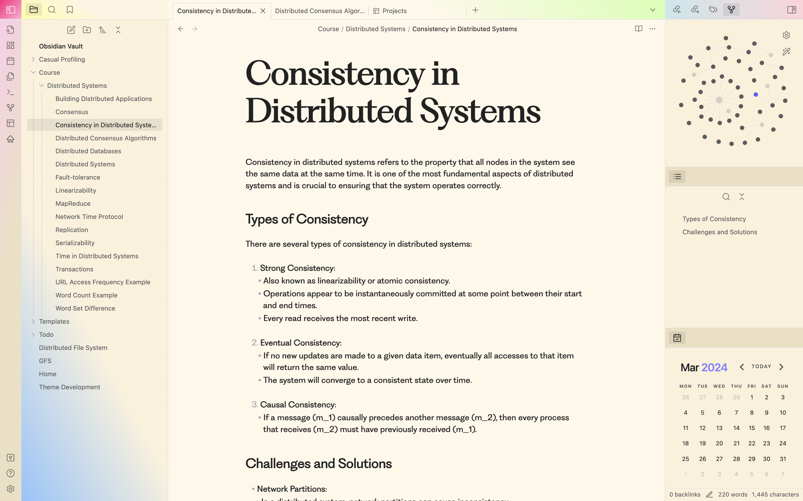

# Holi - A Vibrant and Expressive Obsidian Theme

Holi is a colorful and expressive theme for Obsidian, designed to inspire creativity and vibrancy in your note-taking experience. Drawing inspiration from the vibrant hues of the Indian festival of colors, this theme aims to bring a burst of energy and joy to your digital workspace.

## The Idea Behind the Design

The concept behind Holi's design is to create a visual environment that celebrates self-expression and encourages free-flowing thoughts. By incorporating a rich palette of vivid colors, the theme aims to stimulate the senses and foster an atmosphere conducive to creative thinking and exploration.

## Design Principles

Holi adheres to the following design principles:

1. **Color Harmony**: The theme utilizes a carefully curated color palette that combines complementary and analogous hues, creating a visually appealing and cohesive experience.

2. **Readability**: While embracing vibrant colors, Holi ensures that text remains legible and comfortable to read, preventing eye strain during extended note-taking sessions.

3. **Aesthetic Delight**: Holi's design incorporates playful elements and subtle animations, adding a touch of whimsy and delight to the user experience.

4. **Customization**: The theme offers various customization options, allowing users to tailor the appearance to their personal preferences and workflow requirements.

5. **Typography**: Holi uses the [PP Fragment](https://pangrampangram.com/products/fragment) font family, a modern and expressive typeface that complements the theme's vibrant color palette.

## Promoting Creativity

Holi is designed to promote creativity in several ways:

- **Vibrant Colors**: The vivid color palette is intended to spark inspiration and encourage creative expression, making it easier to visualize and explore ideas.

- **Minimalist Design**: The clean and uncluttered interface reduces visual distractions, allowing users to focus on their thoughts and ideas without unnecessary distractions.

- **Expressive Elements**: The theme incorporates subtle animations and playful elements, fostering a sense of joy and encouraging users to embrace their creative side.

- **Flexible Customization**: By providing customization options, Holi empowers users to personalize their note-taking environment, aligning it with their unique creative processes and preferences.

Whether you're a writer, artist, student, or professional, Holi aims to elevate your note-taking experience by combining functionality with a visually stimulating and expressive design. Embrace the vibrant colors and let your creativity flourish!

## Installation

Inside Obsidian, go to `Settings ➞ Appearance ➞ Manage`, and look for `Holi`.

You can also manually install Holi by:

1. Downloading the CSS file and moving it into the folder `.obsidian/themes/` located in your vault folder;
2. Rename the CSS file to `Holi.css`;
3. In Obsidian, go to `Settings ➞ Appearance ➞ Themes ➞ Reload themes`, and select `Holi`.

## Disclaimer

The following theme significantly alters Obsidian's original CSS, and so is prone to breaking upon new Obsidian updates, as well as being incompatible with custom CSS snippets, which might require specific adjustments.

## Recommended Plugins

- **Smart Typography**: for a better and coherent writing experience
- **Contextual Typography**: For a better typographic experience, and access to some of the theme's features

## Feedback & Contributions

If you encounter an issue, or would like to contribute to this theme, don't hesitate to submit an issue or raise a PR. You can also message me on Discord @jdaniel or on the Obsidian Forums.

## Support

If you enjoy my work and would like to support it, you may click the icons below, or the links on the right side of this repository.

## License

This project is licensed under the [MIT License](LICENSE).